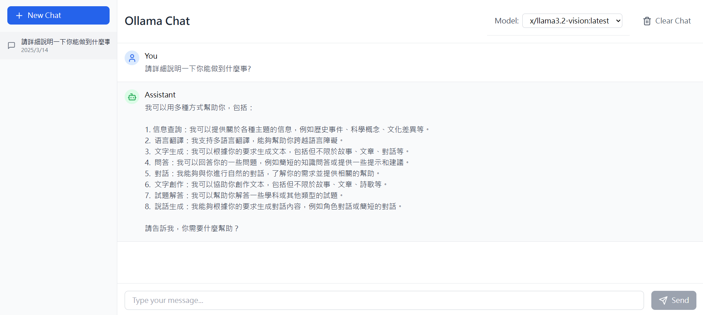

# Ollama Chat Interface

This project is simply a practice exercise. I want to try turning the local Ollama into a UI interface for easier personal use. 
There are still many areas for improvement, such as a user account login system, multimodal LLM file uploading, and other features.

## Features

- 💬 Real-time chat interface
- 📚 Multiple chat sessions support
- 💾 Local storage for chat history
- 🔄 Model switching capability
- 🎨 Clean and responsive UI
- 🌐 Integration with local Ollama API

## Prerequisites

- Node.js (v18 or higher)
- Ollama running locally on port 11434

## Getting Started

1. Clone the repository
2. Install dependencies:
   ```bash
   npm install
   ```
3. Start the development server:
   ```bash
   npm run dev
   ```
4. Open your browser and navigate to the local server URL

## Usage

1. Make sure Ollama is running locally
2. Click "New Chat" to start a conversation
3. Select your preferred model from the dropdown
4. Type your message and press Send
5. Previous conversations are saved automatically
6. Use the sidebar to switch between different chat sessions

## Tech Stack

- React
- TypeScript
- Tailwind CSS
- Vite
- Lucide React Icons

## API Integration

The application connects to Ollama's local API endpoints:
- GET `/api/tags` - Fetch available models
- POST `/api/chat` - Send chat messages

## Development

The project uses:
- ESLint for code linting
- TypeScript for type safety
- Tailwind CSS for styling
- Vite for fast development and building
